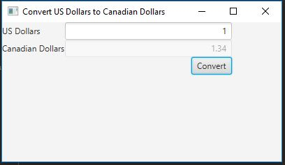

# Exam 2 Hands-On

This is my Exam 2 Hands-On portion. It allows the user to convert any US Dollar amount
and convert it to Canadian Dollars using the current exchange rate. 1.34 Canadian dollars
to 1 US Dollar.

## Example Output

## Analysis Steps

When designing the program I decided to use two Text Fields, having one with editing disabled.
I then decided that a GridPane would be the best way to fill the scene.

### Design

I started by creating text fields for each Dollar amount and disabling editing of the Canadian Dollars TextField.
Then I created a Button to use to start the conversion. All of this was then put into a GridPane that was then used
to fill the scene.

### Testing

The only way I was able to properly test the program was by fully writing it and then testing it as a whole. 
The program worked on the first test.

## Notes

Explain any issues or testing instructions.

## Do not change content below this line
## Adapted from a README Built With

* [Dropwizard](http://www.dropwizard.io/1.0.2/docs/) - The web framework used
* [Maven](https://maven.apache.org/) - Dependency Management
* [ROME](https://rometools.github.io/rome/) - Used to generate RSS Feeds

## Contributing

Please read [CONTRIBUTING.md](https://gist.github.com/PurpleBooth/b24679402957c63ec426) for details on our code of conduct, and the process for submitting pull requests to us.

## Versioning

We use [SemVer](http://semver.org/) for versioning. For the versions available, see the [tags on this repository](https://github.com/your/project/tags). 

## Authors

* **Billie Thompson** - *Initial work* - [PurpleBooth](https://github.com/PurpleBooth)

See also the list of [contributors](https://github.com/your/project/contributors) who participated in this project.

## License

This project is licensed under the MIT License - see the [LICENSE.md](LICENSE.md) file for details

## Acknowledgments

* Hat tip to anyone who's code was used
* Inspiration
* etc
