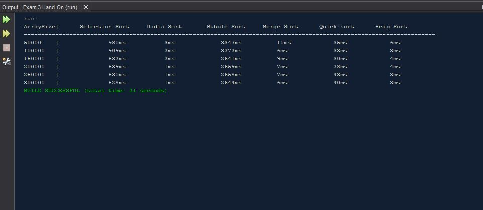

# Exam 3 Hands-On

The goal was to write a program that obtains the execution time of selection sort,
radix sort, bubble sort, merge sort, quick sort, and heap sort for input size:
50000, 100,000, 150,000, 200,000, 250,000, and 300,000.

## Example Output

## Analysis Steps

The goal was to write a program that obtains the execution time of selection sort,
radix sort, bubble sort, merge sort, quick sort, and heap sort for input size:
50000, 100,000, 150,000, 200,000, 250,000, and 300,000. Using pseudo randomly generated data.

### Design

During the design process I thought that reinventing the wheel was just not needed and used the
given code for the various sorts from the book, with the exception of the heap sort. The heap sort I
had to do a bit of research on and build from scratch.

### Testing

Like most of my projects, I started the testing phase with very small manageable numbers. I created an
array of pseudo random data with size 10 and ran it through each sort to make sure they were all functioning.
Once they were all working I began testing the given size values. I then implemented the given code to find
the execution times of the sorts and began printing those in a table format.

## Notes

Explain any issues or testing instructions.

## Do not change content below this line
## Adapted from a README Built With

* [Dropwizard](http://www.dropwizard.io/1.0.2/docs/) - The web framework used
* [Maven](https://maven.apache.org/) - Dependency Management
* [ROME](https://rometools.github.io/rome/) - Used to generate RSS Feeds

## Contributing

Please read [CONTRIBUTING.md](https://gist.github.com/PurpleBooth/b24679402957c63ec426) for details on our code of conduct, and the process for submitting pull requests to us.

## Versioning

We use [SemVer](http://semver.org/) for versioning. For the versions available, see the [tags on this repository](https://github.com/your/project/tags). 

## Authors

* **Billie Thompson** - *Initial work* - [PurpleBooth](https://github.com/PurpleBooth)

See also the list of [contributors](https://github.com/your/project/contributors) who participated in this project.

## License

This project is licensed under the MIT License - see the [LICENSE.md](LICENSE.md) file for details

## Acknowledgments

* Hat tip to anyone who's code was used
* Inspiration
* etc
