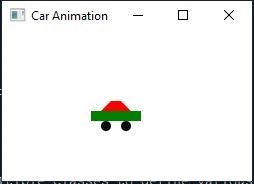

# Exercise 15.29

The purpose of this program is to create an animation of a car moving across the stage. 
There are two classes with the project, one for the creation of the animation and the other 
as a control for the animation. The user is able to use the mouse to pause or play the animation
 and the up and down arrow keys on the keyboard to speed up or slow down the car. Pressing the up 
arrow will cause the car to move faster by increments of one. The Down arrow will decrease the speed
by increments of one.

## Example Output

## Analysis Steps

The Purpose of this program was to have a car move from left to right with the animation restarting
once the car reached the right side, redrawing the car as it moved along the stage. The user was also
supposed to be able to control the speed of the car through the use of the up and down arrow keys.

### Design

I thought it would be easier to create and control the car's animation by creating two separate classes,
one for the controls and one for the animation. I started by creating a Subclass of the Pane Class, naming 
it CarPane, to house my car, its animation, and speed control methods. Then I created a class to house my
controls, stage, and main method.

### Testing

In order to test the program I created a single circle to test the animation and controls, before building the rest of the car.
Once the circle animation functioned properly, I created a method to create a car out of shapes.
I then tested the program with the car.

## Notes

N/A

## Do not change content below this line
## Adapted from a README Built With

* [Dropwizard](http://www.dropwizard.io/1.0.2/docs/) - The web framework used
* [Maven](https://maven.apache.org/) - Dependency Management
* [ROME](https://rometools.github.io/rome/) - Used to generate RSS Feeds

## Contributing

Please read [CONTRIBUTING.md](https://gist.github.com/PurpleBooth/b24679402957c63ec426) for details on our code of conduct, and the process for submitting pull requests to us.

## Versioning

We use [SemVer](http://semver.org/) for versioning. For the versions available, see the [tags on this repository](https://github.com/your/project/tags). 

## Authors

* **Billie Thompson** - *Initial work* - [PurpleBooth](https://github.com/PurpleBooth)

See also the list of [contributors](https://github.com/your/project/contributors) who participated in this project.

## License

This project is licensed under the MIT License - see the [LICENSE.md](LICENSE.md) file for details

## Acknowledgments

* Hat tip to anyone who's code was used
* Inspiration
* etc
