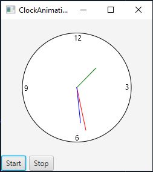

# Exercise 15.32

The purpose of this program was to create a clock animation that is controlled through the use of buttons.
These buttons are the Start and the Stop buttons. The Start button plays the animation, while the Stop button
pauses the animation.

## Example Output

## Analysis Steps

I looked at the instructions and immediately looked at the book for ideas on how to create a ClockPane Class.

### Design

I initially built the control class from scratch, but had a large amount of bugs, after hours of testing and
debugging I went back into the book to see if there was an example that I could look at and decipher what was 
wrong with my code. I then chose to make better use of my time and took the code from the book and manipulated it
to fit my needs.

### Testing

My initial testing was with the clock animation itself. I made sure that worked before adding anything else.
Once the clock animation was working I implemented the buttons that were required by the the assignment.
With those working the program was running smoothly and was complete.

## Notes

Explain any issues or testing instructions.

## Do not change content below this line
## Adapted from a README Built With

* [Dropwizard](http://www.dropwizard.io/1.0.2/docs/) - The web framework used
* [Maven](https://maven.apache.org/) - Dependency Management
* [ROME](https://rometools.github.io/rome/) - Used to generate RSS Feeds

## Contributing

Please read [CONTRIBUTING.md](https://gist.github.com/PurpleBooth/b24679402957c63ec426) for details on our code of conduct, and the process for submitting pull requests to us.

## Versioning

We use [SemVer](http://semver.org/) for versioning. For the versions available, see the [tags on this repository](https://github.com/your/project/tags). 

## Authors

* **Billie Thompson** - *Initial work* - [PurpleBooth](https://github.com/PurpleBooth)

See also the list of [contributors](https://github.com/your/project/contributors) who participated in this project.

## License

This project is licensed under the MIT License - see the [LICENSE.md](LICENSE.md) file for details

## Acknowledgments

* Hat tip to anyone who's code was used
* Inspiration
* etc
