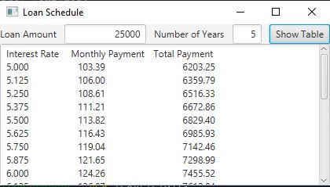

# Exercise 16.13

The purpose of the program is to take the user's loan info and display the monthly and total payments with interests rates ranging from 5.00 to 8.00.

## Example Output

## Analysis Steps

When first looking at the assignment I decided to use the equations from  the given exercise and some of the code I used in Exercise 16.6.

### Design

I used the concepts from the last assignment and the given equations to create a program that took user input in the form of texts boxes to print the Interest Rates, Monthly Payments, and the Total Payments.

### Testing

Testing for this project was difficult to do without the entire program being complete. Once it was complete I adjusted the output in the TextArea until I was happy with how it was presented.

## Notes

N/A

## Do not change content below this line
## Adapted from a README Built With

* [Dropwizard](http://www.dropwizard.io/1.0.2/docs/) - The web framework used
* [Maven](https://maven.apache.org/) - Dependency Management
* [ROME](https://rometools.github.io/rome/) - Used to generate RSS Feeds

## Contributing

Please read [CONTRIBUTING.md](https://gist.github.com/PurpleBooth/b24679402957c63ec426) for details on our code of conduct, and the process for submitting pull requests to us.

## Versioning

We use [SemVer](http://semver.org/) for versioning. For the versions available, see the [tags on this repository](https://github.com/your/project/tags). 

## Authors

* **Billie Thompson** - *Initial work* - [PurpleBooth](https://github.com/PurpleBooth)

See also the list of [contributors](https://github.com/your/project/contributors) who participated in this project.

## License

This project is licensed under the MIT License - see the [LICENSE.md](LICENSE.md) file for details

## Acknowledgments

* Hat tip to anyone who's code was used
* Inspiration
* etc
