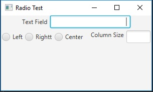

# Exercise 16.6

The purpose of the project was to create a JavaFX program that changed the properties of a text field dynamically. 

## Example Output

## Analysis Steps

The exercise was to write a program that sets the horizontal-alignment and column-size properties of a text field dynamically.
I used the code from class as a reference and decided to do some research within the book in order to get an even better understanding
of the code involved. I found an easier way to set the action event of the radio buttons than the one in class and implemented that.

### Design

I designed my program just as the ones in Listing16_2 through Listing16_4 were set up.

### Testing

After I added the radio buttons, I tested the program to see if it functioned.
When it functioned, I then added the VBox and tested to see if the textfield's size changed.

## Notes

No notes available

## Do not change content below this line
## Adapted from a README Built With

* [Dropwizard](http://www.dropwizard.io/1.0.2/docs/) - The web framework used
* [Maven](https://maven.apache.org/) - Dependency Management
* [ROME](https://rometools.github.io/rome/) - Used to generate RSS Feeds

## Contributing

Please read [CONTRIBUTING.md](https://gist.github.com/PurpleBooth/b24679402957c63ec426) for details on our code of conduct, and the process for submitting pull requests to us.

## Versioning

We use [SemVer](http://semver.org/) for versioning. For the versions available, see the [tags on this repository](https://github.com/your/project/tags). 

## Authors

* **Billie Thompson** - *Initial work* - [PurpleBooth](https://github.com/PurpleBooth)

See also the list of [contributors](https://github.com/your/project/contributors) who participated in this project.

## License

This project is licensed under the MIT License - see the [LICENSE.md](LICENSE.md) file for details

## Acknowledgments

* Hat tip to anyone who's code was used
* Inspiration
* etc
