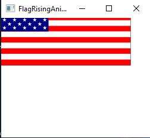

# Exercise 30_3

the goal was to rewrite Listing 15.13 using a thread to animate a flag being
raised. I was then instructed to compare the program with Listing 15.13 by 
setting the delay time to 10 in both programs and determine which one is the
faster of the two.

## Example Output

## Analysis Steps

When analyzing the project I turned to Listing 15.3 and chapter 30 to figure out the design of the program.

### Design

I designed the program by implementing threads into Listing15_3.

### Testing

Once everything was written I ran it, but do not see a difference, so I do not know If I have written correct
code or not.

## Notes

I don't believe I was able to get it to properly run.

## Do not change content below this line
## Adapted from a README Built With

* [Dropwizard](http://www.dropwizard.io/1.0.2/docs/) - The web framework used
* [Maven](https://maven.apache.org/) - Dependency Management
* [ROME](https://rometools.github.io/rome/) - Used to generate RSS Feeds

## Contributing

Please read [CONTRIBUTING.md](https://gist.github.com/PurpleBooth/b24679402957c63ec426) for details on our code of conduct, and the process for submitting pull requests to us.

## Versioning

We use [SemVer](http://semver.org/) for versioning. For the versions available, see the [tags on this repository](https://github.com/your/project/tags). 

## Authors

* **Billie Thompson** - *Initial work* - [PurpleBooth](https://github.com/PurpleBooth)

See also the list of [contributors](https://github.com/your/project/contributors) who participated in this project.

## License

This project is licensed under the MIT License - see the [LICENSE.md](LICENSE.md) file for details

## Acknowledgments

* Hat tip to anyone who's code was used
* Inspiration
* etc
